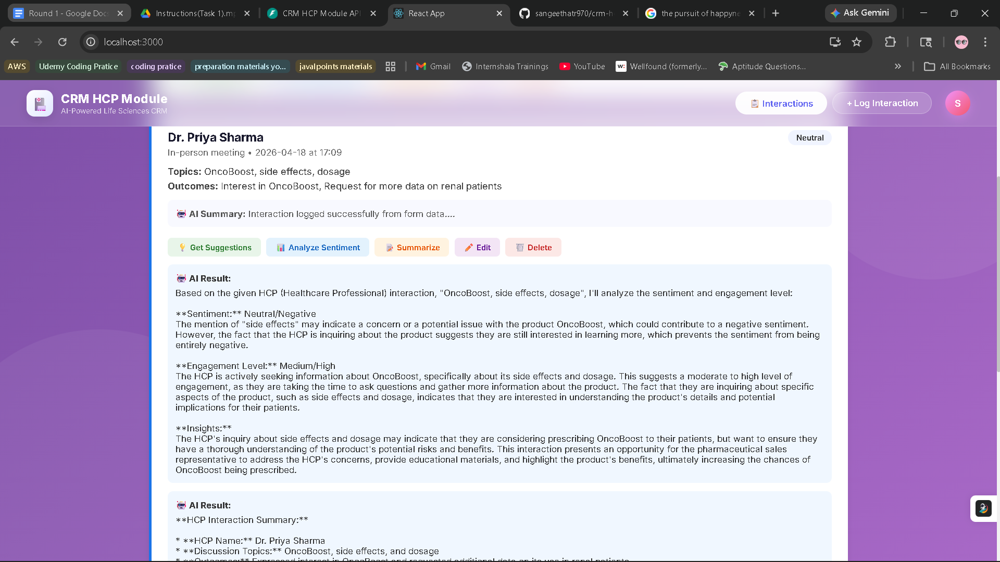
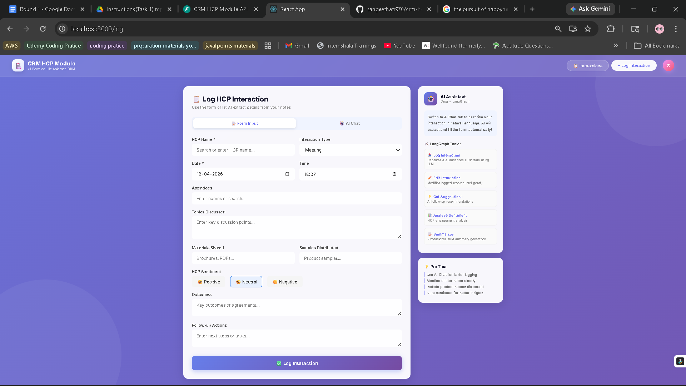
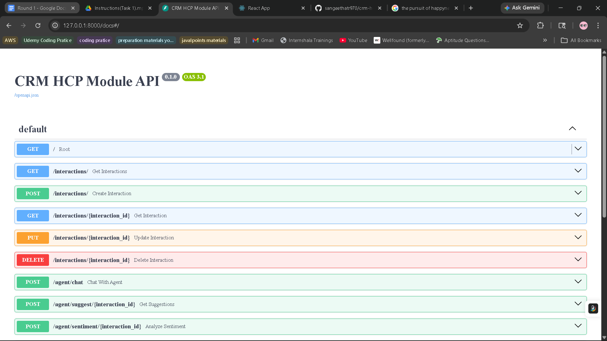
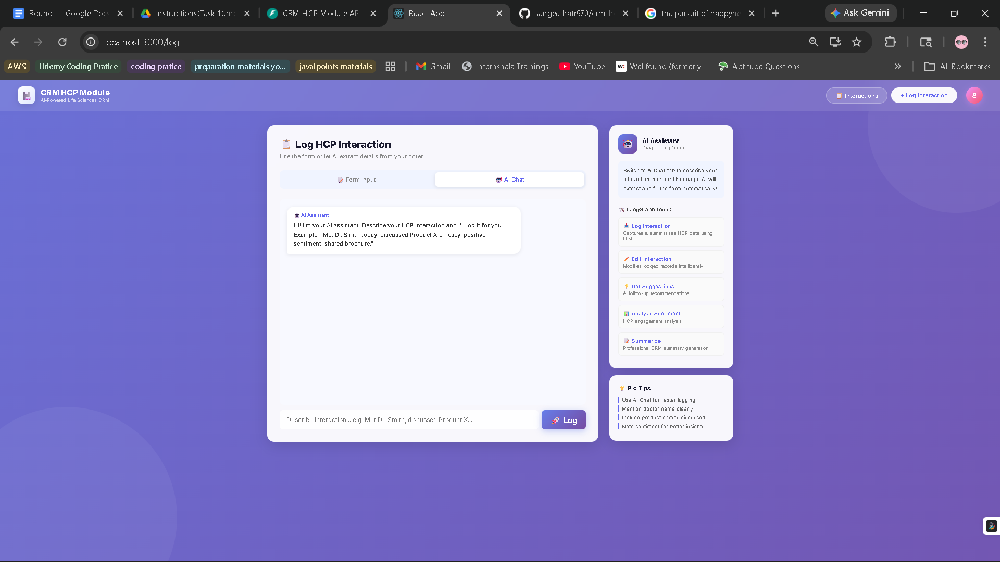
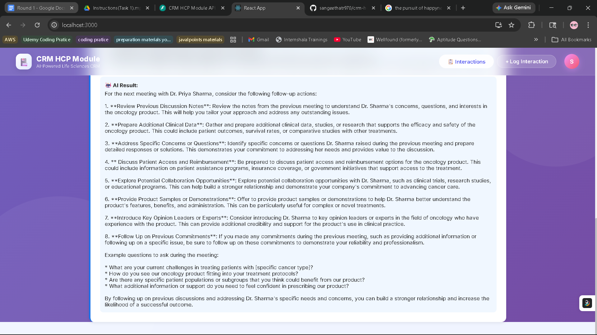

# 🏥 CRM HCP Module — AI-First Life Sciences CRM

> An AI-powered Customer Relationship Management (CRM) system for Healthcare Professionals (HCPs) in Life Sciences, built with LangGraph, Groq LLM, React, and FastAPI.

---

## 🚀 Overview

This CRM system is designed for pharmaceutical field representatives to log and manage interactions with Healthcare Professionals (HCPs). It features a dual-mode interaction logging system — a structured form AND a conversational AI chat interface — powered by LangGraph and Groq LLM.

---

## 🧠 Tech Stack

| Layer | Technology |
|-------|------------|
| Frontend | React 18, Redux Toolkit, React Router, Recharts |
| Backend | Python 3.11, FastAPI, Uvicorn |
| AI Agent Framework | LangGraph |
| LLM Provider | Groq (llama-3.3-70b-versatile) |
| Database | MySQL 8.0 |
| ORM | SQLAlchemy |
| Font | Google Inter |

---
## 📸 Screenshots

### 🏠 Home — HCP Interactions List


### 📝 Log Interaction Form


### Docs


### AI Chatbot


### AI Summary


## 🛠️ LangGraph AI Agent & Tools

The LangGraph agent acts as the intelligent brain of the CRM system. It routes user requests to the appropriate tool based on the action required.

### Agent Architecture
User Input
↓
LangGraph StateGraph
↓
Tool Router (select_tool node)
↓
┌─────────────────────────────────────────┐
│  Tool 1: log_interaction                │
│  Tool 2: edit_interaction               │
│  Tool 3: get_hcp_suggestions            │
│  Tool 4: analyze_sentiment              │
│  Tool 5: summarize_interaction          │
└─────────────────────────────────────────┘
↓
Groq LLM (llama-3.3-70b-versatile)
↓
MySQL Database

### Tool Descriptions

#### 1. 📥 Log Interaction
- Captures HCP interaction data from either form input or natural language chat
- Uses Groq LLM to extract structured data: HCP name, sentiment, topics, outcomes
- Generates AI summary of the interaction for CRM records
- Supports entity extraction from free-form text

#### 2. ✏️ Edit Interaction
- Allows modification of previously logged interaction data
- Uses LLM to validate and suggest improvements to updated data
- Returns AI-generated confirmation and recommendations

#### 3. 💡 Get HCP Suggestions
- Generates AI-powered follow-up recommendations for sales representatives
- Analyzes HCP profile and past interactions to suggest next steps
- Examples: Schedule follow-up, send clinical data, invite to advisory board

#### 4. 📊 Analyze Sentiment
- Analyzes HCP engagement level from interaction notes and topics discussed
- Identifies positive, neutral, or negative sentiment patterns
- Provides detailed sentiment breakdown for CRM insights

#### 5. 📝 Summarize Interaction
- Creates professional CRM-ready summaries of HCP interactions
- Condenses key points: topics, outcomes, follow-up actions
- Formats output for medical sales documentation standards

---

## ✨ Features

- 📝 **Dual Input Mode** — Log via structured form OR conversational AI chat
- 🤖 **AI Chat Interface** — Describe interaction naturally, AI extracts and fills form
- 📊 **Analytics Dashboard** — Sentiment pie chart and interaction type bar chart
- 💡 **AI Follow-up Suggestions** — Automatic next-step recommendations
- 👤 **HCP Profile Cards** — AI-generated profile summaries for each doctor
- 🔍 **Search & Filter** — Filter by HCP name, sentiment, or interaction type
- ✏️ **Edit & Delete** — Full CRUD operations on all interactions
- 🎨 **Modern UI** — Glassmorphism design with animated gradient background

---

## 🏗️ Project Structure
crm-hcp-module/
├── backend/
│   ├── main.py          # FastAPI routes and endpoints
│   ├── agent.py         # LangGraph agent and 5 tools
│   ├── database.py      # SQLAlchemy models and DB setup
│   ├── .env             # Environment variables (not committed)
│   └── venv/            # Python virtual environment
├── frontend/
│   ├── src/
│   │   ├── App.js                          # Main app with routing
│   │   ├── store.js                        # Redux store and slices
│   │   ├── index.css                       # Global styles
│   │   └── components/
│   │       ├── Navbar.js                   # Navigation bar
│   │       ├── InteractionList.js          # HCP interactions list + dashboard
│   │       └── LogInteractionScreen.js     # Log/Edit interaction screen
│   └── package.json
├── .gitignore
└── README.md

---

## ⚙️ Setup Instructions

### Prerequisites
- Python 3.11
- Node.js v18+
- MySQL 8.0
- Groq API Key (free at https://console.groq.com)

### 1. Database Setup
```sql
CREATE DATABASE crm_hcp;
```

### 2. Backend Setup
```bash
cd backend
python -m venv venv
venv\Scripts\activate  # Windows
pip install fastapi uvicorn langgraph langchain langchain-groq langchain-core pymysql sqlalchemy python-dotenv pydantic
```

Create a `.env` file in the backend folder:
```env
GROQ_API_KEY=your_groq_api_key_here
DB_HOST=localhost
DB_PORT=3306
DB_USER=root
DB_PASSWORD=your_mysql_password
DB_NAME=crm_hcp
```

Start the backend:
```bash
uvicorn main:app --reload
```

Backend runs at: http://127.0.0.1:8000
API Docs at: http://127.0.0.1:8000/docs

### 3. Frontend Setup
```bash
cd frontend
npm install
npm install @reduxjs/toolkit react-redux axios react-router-dom recharts
npm start
```

Frontend runs at: http://localhost:3000

---

## 📡 API Endpoints

| Method | Endpoint | Description |
|--------|----------|-------------|
| GET | /interactions/ | Get all interactions |
| POST | /interactions/ | Create new interaction |
| GET | /interactions/{id} | Get single interaction |
| PUT | /interactions/{id} | Update interaction |
| DELETE | /interactions/{id} | Delete interaction |
| POST | /agent/chat | Chat with AI agent |
| POST | /agent/suggest/{id} | Get AI suggestions |
| POST | /agent/sentiment/{id} | Analyze sentiment |
| POST | /agent/summarize/{id} | Summarize interaction |

---

## 🎥 Demo Walkthrough

1. Open http://localhost:3000
2. Click **"+ Log New Interaction"**
3. Try **Form Input** — fill in HCP details and submit
4. Try **AI Chat** — type: *"Met Dr. Priya today, discussed OncoBoost Phase III, positive sentiment, shared brochure"*
5. Go back to **All Interactions**
6. Click **💡 Get Suggestions** to see AI follow-up recommendations
7. Click **📊 Analyze Sentiment** for sentiment analysis
8. Click **📝 Summarize** for professional CRM summary
9. Click **👤 HCP Profile** for AI-generated doctor profile
10. Click **📊 Show Dashboard** for analytics charts

---

## 👩‍💻 Author

**Sangeetha T R Raj** — Full Stack Developer
- GitHub: [@sangeethatr970](https://github.com/sangeethatr970)

---

## 📄 License

MIT License — feel free to use and modify for your projects.
